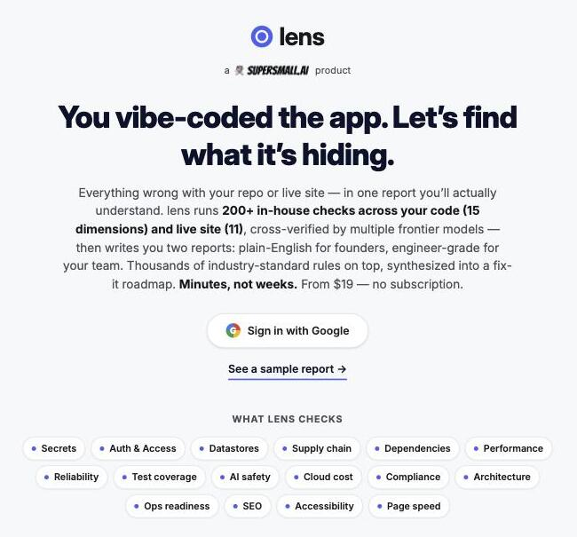
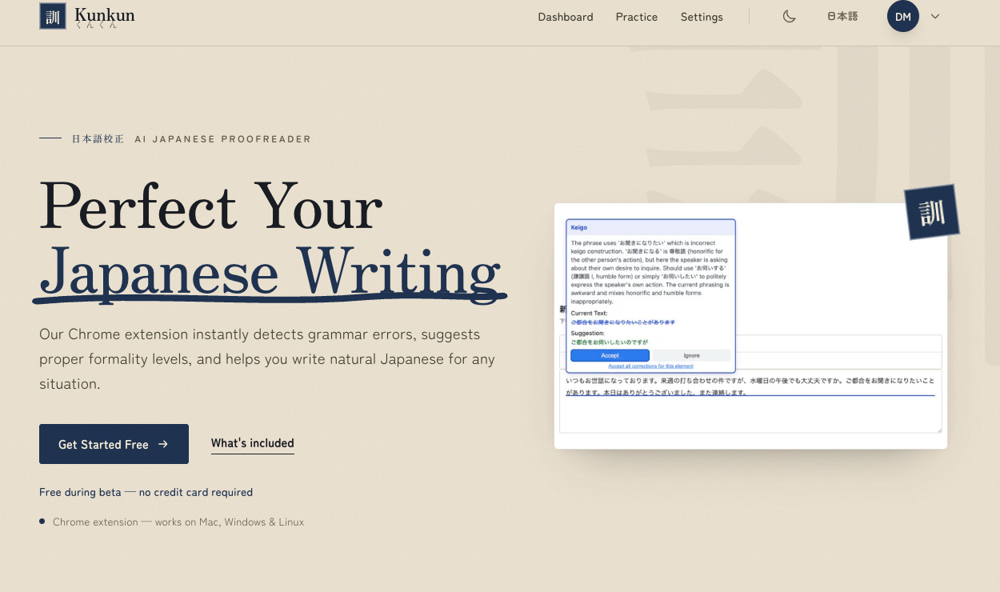
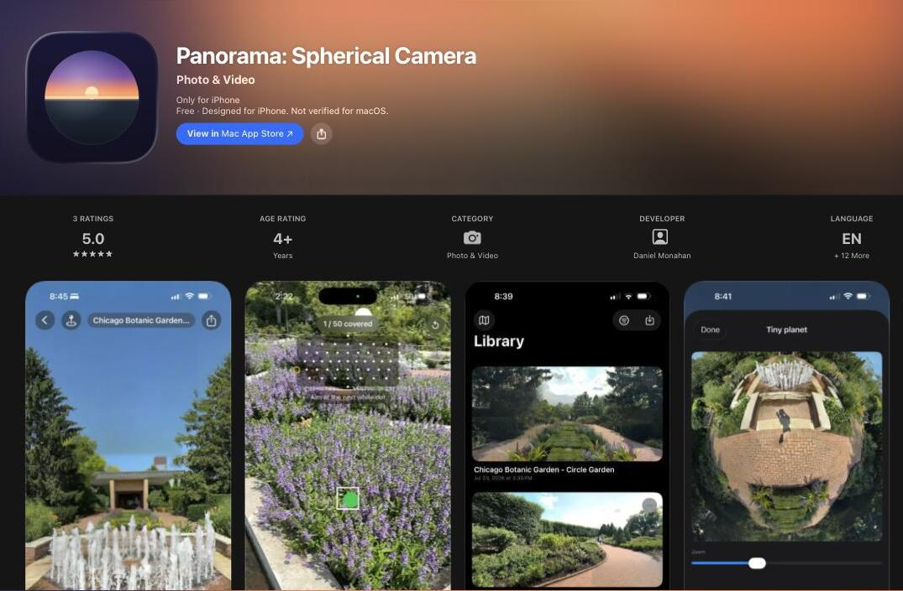
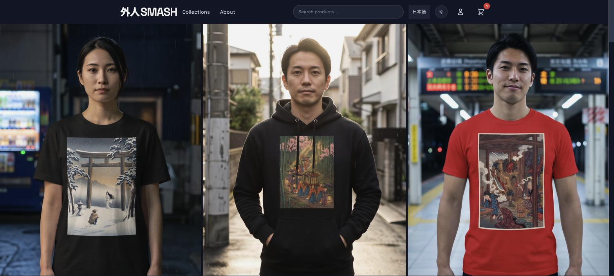

# Dan Monahan

Twenty years building and leading engineering teams. Below is the work itself — live products you can open, source you can read.

My focus is AI on both sides: embedding it into products (RAG, agentic systems), and using it to change how engineering teams build software. I host and speak on getting agents past the demo and into production.

**Open to engineering leadership and Forward Deployed Engineer (FDE) roles.** Reach me on [LinkedIn](https://www.linkedin.com/in/danielemonahan/).

---

### Stack

- **Languages** — [Python](https://github.com/monahand1023/corpus) · [Go](https://github.com/monahand1023/imageclust) · [C](https://github.com/monahand1023/pdfcracker) · [Java](https://github.com/monahand1023/TPSGenerator) · [TypeScript](https://github.com/monahand1023/online-storefront) · [Swift](https://apps.apple.com/us/app/panorama-spherical-camera/id6786430972)
- **AI** — [Multi-agent systems](https://lens.supersmall.ai/sample) · [RAG and hybrid search](https://github.com/monahand1023/corpus) · [MCP servers](https://github.com/monahand1023/corpus) · [AWS Bedrock](https://kunkun.io) · Local inference ([Whisper](https://github.com/monahand1023/cleancut) · [CLIP](https://github.com/monahand1023/imageclust) · [Ollama](https://github.com/monahand1023/rehearsal))
- **Systems** — [Metal GPU compute](https://github.com/monahand1023/pdfcracker) · [ARM NEON SIMD](https://github.com/monahand1023/pdfcracker) · [Lock-free concurrency and virtual threads](https://github.com/monahand1023/TPSGenerator)
- **Web and mobile** — [Vue](https://github.com/monahand1023/online-storefront) · [React](https://github.com/monahand1023/imageclust) · [Spring Boot](https://github.com/monahand1023/TPSGenerator-Server) · [FastAPI](https://github.com/monahand1023/rehearsal) · [iOS (Swift, ARKit)](https://apps.apple.com/us/app/panorama-spherical-camera/id6786430972) · [Chrome extension](https://kunkun.io) · [Google Docs add-on](https://kunkun.io)
- **Cloud and delivery** — [AWS Lambda](https://kunkun.io) · [CloudFront](https://gaijin-smash.net) · [Netlify Functions](https://github.com/monahand1023/online-storefront) · [Docker images on GHCR](https://github.com/monahand1023?tab=packages) · [PyPI](https://pypi.org/project/corpus-rag/) · [App Store](https://apps.apple.com/us/app/panorama-spherical-camera/id6786430972)

---

### Shipped products

Every product below was built solo, end-to-end — the same AI-native practices I bring to a team, applied at n=1. Several ship in Spanish or Japanese rather than in translation; I'm trilingual (native English and Spanish, advanced Japanese, JLPT N2).

#### lens · **Live:** [lens.supersmall.ai](https://lens.supersmall.ai) · [sample report](https://lens.supersmall.ai/sample)

Multi-agent AI audit engine, founded and built solo, live and taking paying customers.
- 200+ checks across 26 dimensions of a codebase and a live site (security, performance, reliability, supply chain, cloud cost, accessibility, SEO) — one reasoning agent per dimension, grounded in deterministic scanners, every finding cross-verified by multiple frontier models to cut false positives
- Also ships as an MCP server, so the audit runs inline in Cursor, Claude Code, or Windsurf before the PR opens
- One audit produces two reports (plain-English for founders, engineer-grade for the team), a full dependency and license inventory (SBOM, in CycloneDX or SPDX format), and a prioritized fix-it roadmap

---

#### Kunkun · **Live:** [kunkun.io](https://kunkun.io)

Japanese grammar-checking SaaS, built and run solo: Grammarly for Japanese.
- Context-aware corrections — politeness level, JLPT focus (N5–N1), and learner-vs-native mode shape every response, and each fix carries a plain-language explanation, not just the fix
- One backend, three surfaces — website, Chrome extension, Google Docs/Slides add-on — all reading live subscription state from the same API
- Go Lambda on AWS Bedrock (Claude/Nova) for inference, Firebase auth, Stripe subscriptions wired in and ready — free during the current beta

---

#### Panorama · **App Store:** [apps.apple.com](https://apps.apple.com/us/app/panorama-spherical-camera/id6786430972)

Turns an iPhone into a spherical-panorama camera, a modern rebuild of the Photosynth experience.
- Guided ARKit sweep auto-captures frames and corrects for the phone's own tracking error
- Stitches into a seamless 360° image on-device with a custom Metal GPU stitcher
- Fully local: no cloud, no accounts, no backend, nothing collected

---

#### Gaijin Smash · **Live:** [gaijin-smash.net](https://gaijin-smash.net)

Bilingual (EN/JA) direct-to-consumer streetwear brand: real Japanese slogans with proper cultural context, not Google Translate.
- AI content pipeline (image generation, model photography, copy) with human review as the quality gate before anything goes live
- Built solo end-to-end: storefront, checkout, CloudFront-backed asset pipeline, admin dashboard

*All four are proprietary — source not public.*

---

### Open-source projects

Local-first tools you can run and audit yourself.

| Project | What it is | Stack |
|---|---|---|
| **[corpus](https://github.com/monahand1023/corpus)** | Ask natural-language questions over your own notes, PDFs, and docs. Hybrid semantic + keyword search with auto-tuned fusion, multi-hop reference expansion, a retrieval eval harness with a CI gate, and a 7-tool MCP server for Claude Code. Storage, index, search, and re-ranking are local; embeddings call your chosen provider. `pip install corpus-rag` | `Python` `RAG` `MCP` |
| **[pdfcracker](https://github.com/monahand1023/pdfcracker)** | Recover passwords from your own encrypted PDFs on macOS. All encryption revisions (R2 to R6), 15+ attack modes, GPU acceleration via Metal, ARM NEON SIMD, distributed cracking. Zero dependencies. | `C` `Metal` `SIMD` |
| **[imageclust](https://github.com/monahand1023/imageclust)** | Clusters photos by *what they're about*, not just how they look. CLIP ViT-L/14 embeddings, Ward hierarchical clustering, and Ollama-generated labels. Entirely on-device. | `Go` `React` `CLIP` |
| **[cleancut](https://github.com/monahand1023/cleancut)** | Drop in a video, get back a cleaned `.mp4`: profanity muted, explicit scenes cut. Layered local AI stack (Whisper, Ollama, NudeNet + LLaVA, HF audio models). Every cut is auditable. | `Python` `Whisper` `Vision` |
| **[rehearsal](https://github.com/monahand1023/rehearsal)** | Practice spoken answers and get AI feedback, entirely on your machine: Whisper transcription, signal analysis of pace, pauses, fillers, and prosody, then a local LLM scores content and STAR structure. A Japanese mode adds a STAMP-aligned proficiency estimate. | `Python` `FastAPI` `Ollama` |
| **[claude-code-skills](https://github.com/monahand1023/claude-code-skills)** | 12 drop-in Claude Code skills for dev workflow and AWS ops. Auto-discover your AWS resources at runtime, no config files. | `Tooling` `AWS` `DX` |
| **[TPSGenerator](https://github.com/monahand1023/TPSGenerator)** | Java load tester for HTTP APIs on a Java 21 virtual-thread engine: stable, ramp-up, spike, and custom traffic patterns, chained scenarios, lock-free HdrHistogram metrics, circuit breaker, real-time resource monitoring. Pairs with [TPSGenerator-Server](https://github.com/monahand1023/TPSGenerator-Server). | `Java` `Concurrency` |
| **[online-storefront](https://github.com/monahand1023/online-storefront)** | Vue 3 + TypeScript storefront for small selling events: order form, Stripe Checkout, and a signed webhook that emails the customer and logs the order to a Google Sheet. No database, no server; fork it, edit one config file, deploy to Netlify. | `TypeScript` `Vue` `Stripe` |

---

### Speaking

- **[ELC: Production AI Agents, Beyond the Demo](https://elc.community/public/events/roundtable-production-ai-agents-beyond-the-demo-fzaux0ry1a)** — hosted, July 2026. Where agents actually run in production versus stay stuck in pilot, and how you monitor a system with no single correct output.
- **[SuperSmall: Vibe-Code to Production](https://luma.com/qtfclu9a)** — featured speaker, June 2026. Taking AI-generated prototypes (Lovable, Cursor, Replit) to production: auth, databases, deployment, performance.

---

Find me on [LinkedIn](https://www.linkedin.com/in/danielemonahan/).

